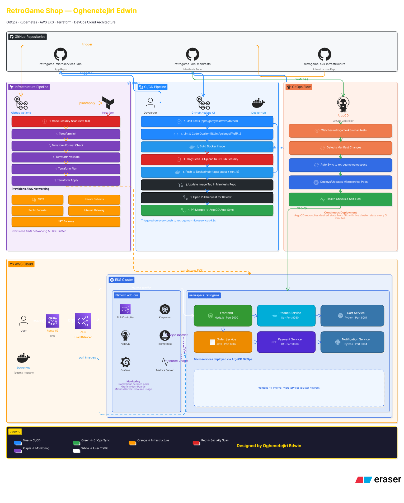
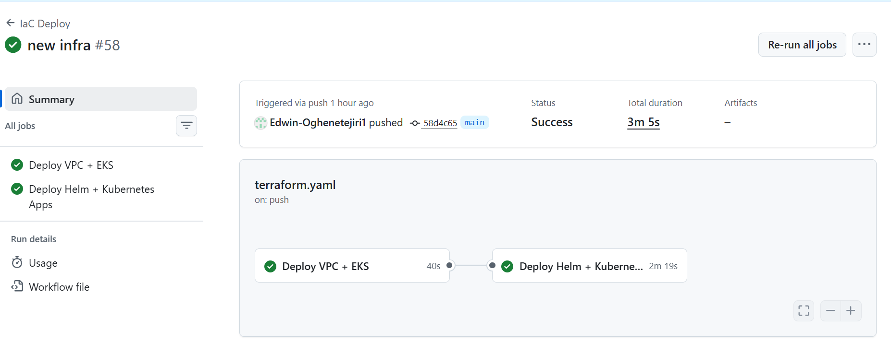
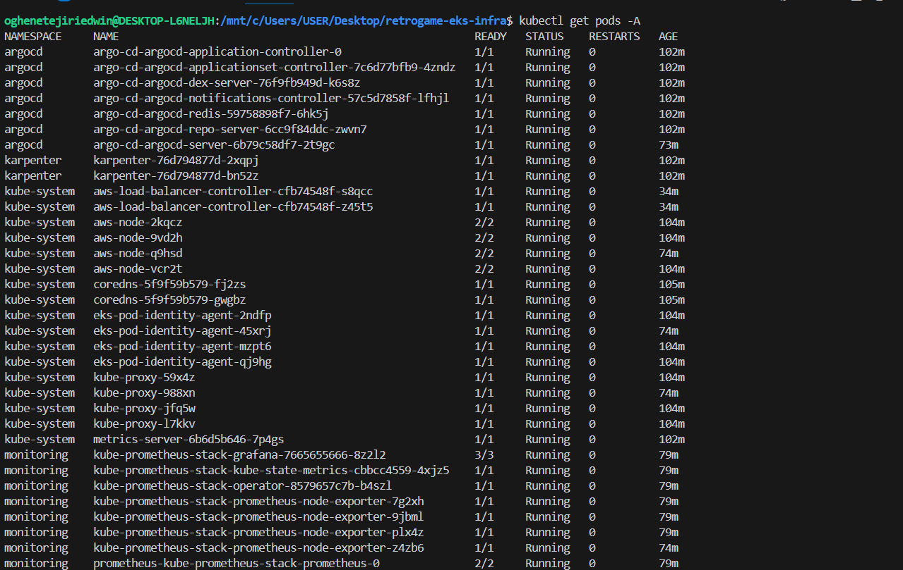
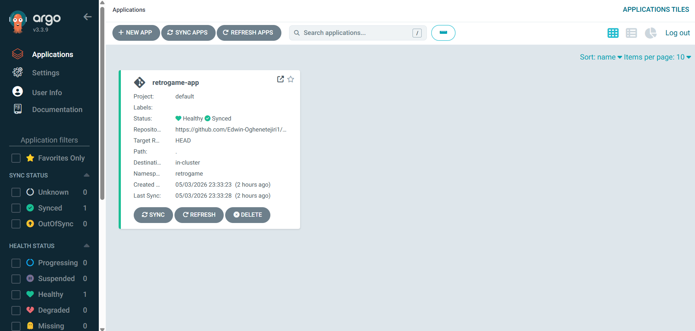
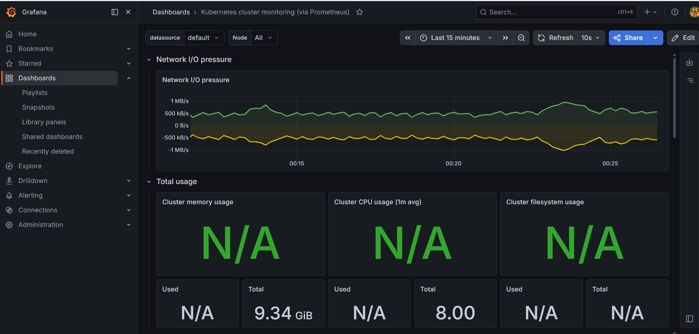

# 🎮 RetroGame EKS Infrastructure

Production-grade AWS EKS infrastructure for the RetroGame microservices platform, 
automated with Terraform and GitHub Actions CI/CD.

[](https://retrogameshop.online)
[](https://www.terraform.io)
[](https://aws.amazon.com)
[](https://kubernetes.io)

---

## 📋 Overview

This repository contains the complete Infrastructure as Code (IaC) for deploying 
a production-grade AWS EKS cluster to host the RetroGame Shop microservices platform. 
Every AWS resource — from VPC and subnets to EKS node groups and IAM roles — is 
defined as Terraform code, versioned in Git and deployed automatically via GitHub Actions.

No manual AWS console clicks. No configuration drift. No undocumented changes. 
**Infrastructure as Code means the Git history is the audit trail.**

---

## 🏗️ What is Terraform and Why Does It Matter?

Terraform is the industry standard open source Infrastructure as Code tool developed 
by HashiCorp. Instead of manually clicking through cloud consoles — which is 
error-prone, hard to repeat and impossible to track — Terraform lets you define 
your entire infrastructure in code.

### Key Benefits:

**📝 Declarative Configuration**
You describe what you want, Terraform figures out how to create it. Define an EKS 
cluster in code and Terraform provisions it identically every single time.

**🔄 Reproducibility**
Destroy the entire infrastructure and recreate it with one command. Every environment 
— dev, staging, production — is provisioned from the same code with different variables.

**📋 Change Tracking**
Every infrastructure change is a Git commit. You know exactly what changed, when it 
changed and who changed it. No more mystery configurations.

**🔒 State Management**
Terraform tracks the current state of your infrastructure in a remote state file 
stored in S3 with DynamoDB locking — preventing concurrent modifications that could 
corrupt your infrastructure.

**🧩 Modular Design**
Reusable modules for VPC, EKS and other components means no code duplication. 
Change the VPC module once and every environment benefits.

---

## 🏛️ Architecture Overview



## 🚀 Infrastructure Components

### 🌐 VPC
- Multi-AZ setup across **3 availability zones** for high availability
- **Public subnets** — ALB and internet-facing resources
- **Private subnets** — EKS worker nodes isolated from direct internet access
- **NAT Gateway** — allows private subnet pods to reach the internet securely
- **Internet Gateway** — routes public traffic into the VPC
- Subnet tagging for ALB controller and Karpenter auto-discovery

### ☸️ EKS Cluster
- **Kubernetes 1.32** — latest stable version
- **Managed node groups** — AWS handles node lifecycle and updates
- **OIDC provider** — enables IRSA (IAM Roles for Service Accounts) so pods 
  can securely access AWS services without hardcoded credentials
- **API authentication mode** — modern EKS access management
- **Multi-AZ node placement** — nodes spread across availability zones

### 🔧 Cluster Addons (Helm)
| Addon | Purpose |
|---|---|
| AWS Load Balancer Controller | Provisions ALBs from Kubernetes ingress resources |
| ArgoCD | GitOps continuous deployment |
| Kube Prometheus Stack | Metrics collection and Grafana dashboards |
| Metrics Server | Pod resource metrics for autoscaling |

### ⚡ Karpenter — Intelligent Node Autoscaling
Unlike traditional cluster autoscaler, Karpenter:
- Provisions the **right EC2 instance type** for the workload automatically
- Supports both **Spot and On-Demand** instances for cost optimization
- **Consolidates underutilized nodes** — if pods can fit on fewer nodes, 
  it moves them and terminates the empty ones
- Provisions new nodes in **seconds** instead of minutes
- Significantly reduces AWS EC2 costs in production

### 🔒 Security
- **OIDC authentication** — GitHub Actions assumes AWS roles using short-lived 
  tokens. No AWS access keys stored anywhere
- **IRSA (IAM Roles for Service Accounts)** — links Kubernetes service accounts 
  to IAM roles via OIDC for pod-level AWS permissions
- **Pod Identity Association** — the newer AWS-native approach for granting IAM 
  permissions directly to pods without needing OIDC annotations on service accounts. 
  Used for Karpenter in this project
- **tfsec** — scans Terraform code for security misconfigurations before every apply
- **Private node groups** — worker nodes have no direct internet exposure
- **S3 state encryption** — Terraform state encrypted at rest
---

## 📁 Repository Structure
```
retrogameshop-eks-infra/
├── envs/
│   └── prod/
│       ├── infra/                  # VPC + EKS (deployed first)
│       │   ├── main.tf             # VPC and EKS modules
│       │   ├── outputs.tf          # Cluster outputs for apps layer
│       │   ├── variables.tf        # Input variables
│       │   ├── providers.tf        # AWS provider + S3 backend
│       │   └── terraform.tfvars    # Production values
│       └── apps/                   # Helm releases (deployed after EKS)
│           ├── main.tf             # ArgoCD, ALB, Karpenter, Prometheus
│           ├── variables.tf        # Input variables
│           ├── providers.tf        # Helm + Kubernetes providers
│           └── terraform.tfvars    # App values
├── modules/
│   ├── vpc/                        # VPC, subnets, NAT gateway, IGW
│   └── eks/                        # EKS cluster, node groups, OIDC
├── application.yaml                # ArgoCD app pointing to manifests repo
├── ingress.yaml                    # ALB ingress for all services
└── .github/
└── workflows/
└── terraform.yaml          # CI/CD pipeline
```
---

## 🔄 CI/CD Pipeline

The infrastructure is deployed automatically via GitHub Actions using two sequential jobs:
```
Push to main branch
↓
┌─────────────────────────────┐
│     Job 1: deploy-infra     │
│                             │
│  1. tfsec security scan     │
│  2. Terraform Init          │
│  3. Terraform Format check  │
│  4. Terraform Validate      │
│  5. Terraform Plan          │
│  6. Terraform Apply         │
│     → VPC + EKS created     │
└─────────────┬───────────────┘
│ needs: deploy-infra
┌─────────────▼───────────────┐
│     Job 2: deploy-apps      │
│                             │
│  1. tfsec security scan     │
│  2. Terraform Init          │
│  3. Terraform Plan          │
│  4. Terraform Apply         │
│     → Helm charts deployed  │
│  5. kubectl get nodes       │
│  6. kubectl get pods -A     │
└─────────────────────────────┘

```

> **Why two jobs?** EKS must exist before Helm charts can be installed. 
> Splitting into `infra` and `apps` with `needs: deploy-infra` solves the 
> Terraform chicken-and-egg problem with Kubernetes providers.

---

## 🔐 OIDC Authentication — No Stored Credentials

This project uses GitHub Actions OIDC integration with AWS:

```yaml
- name: Configure AWS credentials
  uses: aws-actions/configure-aws-credentials@v4
  with:
    role-to-assume: arn:aws:iam::ACCOUNT_ID:role/ROLE_NAME
    role-session-name: GitHubActionsSession
    aws-region: us-east-1
```

**How it works:**

GitHub Actions runner starts
↓
Requests short-lived OIDC token from GitHub
↓
Presents token to AWS STS
↓
AWS verifies token against GitHub OIDC provider
↓
AWS returns temporary credentials (valid for session only)
↓
Terraform runs with those credentials
↓
Credentials expire automatically — nothing stored

No AWS access keys. No secrets rotation. No credential leaks.

---

## 🚀 Deployment

### Prerequisites
- AWS CLI configured
- Terraform >= 1.0
- kubectl
- eksctl

### 1. Create S3 backend and DynamoDB table
```bash
aws s3api create-bucket \
  --bucket retrogame-tfstate-573986291693 \
  --region us-east-1

aws dynamodb create-table \
  --table-name retrogame-terraform-locks \
  --attribute-definitions AttributeName=LockID,AttributeType=S \
  --key-schema AttributeName=LockID,KeyType=HASH \
  --billing-mode PAY_PER_REQUEST \
  --region us-east-1
```

### 2. Deploy VPC + EKS first
```bash
cd envs/prod/infra
terraform init
terraform plan --var-file=terraform.tfvars
terraform apply --var-file=terraform.tfvars
```

### 3. Deploy Helm apps after EKS is ready
```bash
cd envs/prod/apps
terraform init
terraform plan --var-file=terraform.tfvars
terraform apply --var-file=terraform.tfvars
```

### 4. Configure kubectl
```bash
aws eks update-kubeconfig \
  --region us-east-1 \
  --name retrogame-eks
```

### 5. Apply ArgoCD application and ingress
```bash
kubectl apply -f application.yaml
kubectl apply -f ingress.yaml
```

### 6. Verify everything is running
```bash
kubectl get nodes
kubectl get pods -A
kubectl get ingress -A
```

---

## ⚙️ GitHub Actions Secrets Required

| Secret | Description |
|---|---|
| `AWS_ACCOUNT_ID` | Your AWS account ID |
| `AWS_ROLE_NAME` | IAM role for GitHub Actions OIDC |
| `AWS_DEFAULT_REGION` | Target AWS region |
| `BUCKET_TF_STATE` | S3 bucket for Terraform state |
| `DYNAMO_DB_LOCK` | DynamoDB table for state locking |
| `GRAFANA_PASSWORD` | Grafana admin password |

---

## 📊 Microservices Deployed

| Service | Language | Port |
|---|---|---|
| Frontend | Node.js | 3000 |
| Product Service | Go | 8080 |
| Cart Service | Python | 8081 |
| Order Service | Java | 8082 |
| Payment Service | C# | 8083 |
| Notification Service | Python | 8084 |

---

## 🖥️ Production Screenshots

### GitHub Actions Pipeline


### EKS Cluster — All Pods Running


### ArgoCD — Synced


### Grafana — Cluster Monitoring


### Live Site


---

## 🔗 Related Repositories

| Repository | Description |
|---|---|
| [RetroGame Microservices](https://github.com/Edwin-Oghenetejiri1/retrogame-microservices-k8s) | Application source code and CI/CD pipelines |
| [RetroGame K8s Manifests](https://github.com/Edwin-Oghenetejiri1/retrogame-k8s-manifests) | Kubernetes manifests managed by ArgoCD |

---

<div align="center">
  <strong>🌐 Live at <a href="https://retrogameshop.online">retrogameshop.online</a></strong>
</div>


